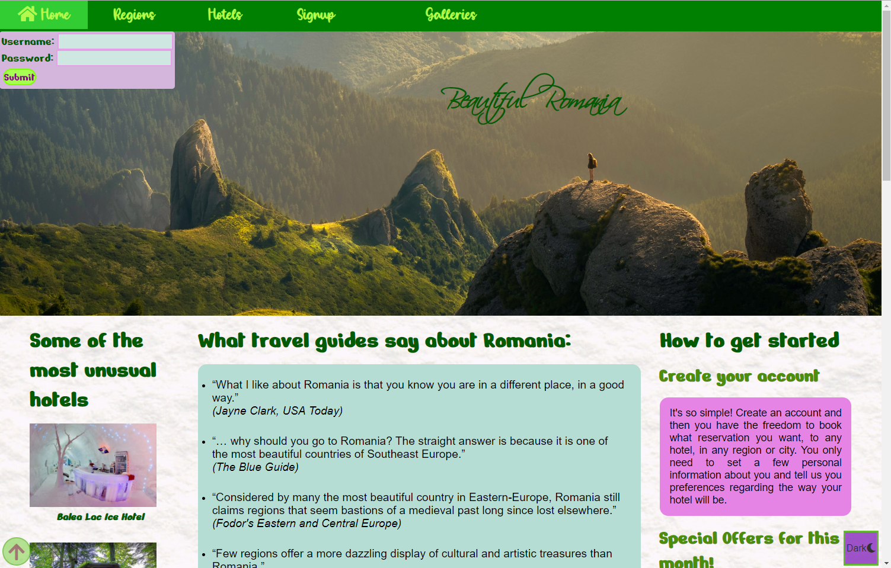

# Beautiful Romania: A booking Website for hotels in Romania
This website is made from scratch, with HTML, CSS, Javascript, Node.js. The main goal of this website is to help tourists find their dream place to stay while visiting the country. They can create an account with a profile picture, login, logout, and see the most amazing hotels from across the country. The hotels cand be filtered and sorted by the users preferences. Every page was stylized from scratch, using CSS and SCSS, and the hotels and the users' accounts where stored in a local MySQL database, which was connected to the project using node.js. 
There are 2 types of accounts: regular users and admins. There are only 2 admins in the database, and they have the ability to delete or update other users' account, and change their priviledges. Once a new user has signed up to this website, he will receive an email at his given address with the details of his account.  
  
  
 

